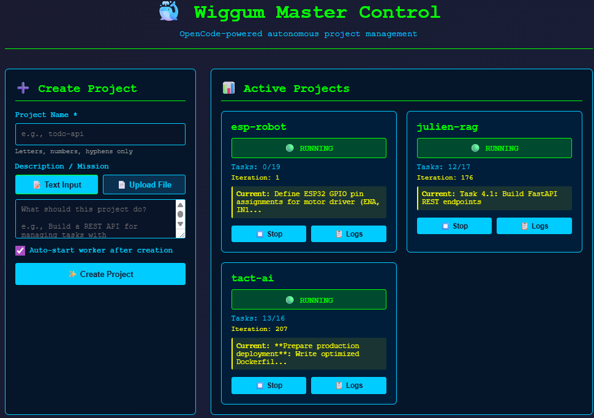
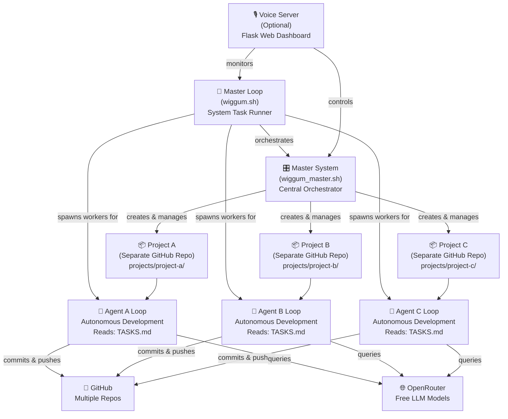

# 🤖 WiggumLoopAgenticSWDeveloper

A **zero-cost**, fully autonomous multi-project AI development system. Orchestrates unlimited OpenCode agents running free LLMs to build, test, and manage projects independently.



## What is This?

**WiggumLoopAgenticSWDeveloper** is a master orchestration system that:
- 🎯 Manages multiple projects (each gets its own GitHub repository)
- 🤖 Runs independent, autonomous AI agents on each project using OpenCode
- 🔄 Orchestrates master + worker loops for concurrent development
- 🗣️ Includes optional web dashboard + voice server for management
- 💰 Costs **exactly $0.00** to run (uses OpenRouter's free tier)
- ⚡ Uses powerful free models: **Gemini 2.0 Flash**, **Qwen 3**, **Step 3.5 Flash**

Each project is a **separate GitHub repository** that develops independently while coordinated by the master system.

---

## 🏗️ System Architecture



---

## ✨ Key Features

| Feature | Benefit |
|---------|---------|
| **Zero Cost** | Free LLM tier = $0/month, unlimited iterations |
| **Multi-Project** | Manage 10+ projects simultaneously |
| **Autonomous Agents** | Each project develops independently 24/7 |
| **GitHub Integration** | Full CI/CD pipeline ready, one repo per project |
| **Voice Control** | Optional web dashboard for management |
| **Template System** | New projects auto-scaffold from templates |
| **Master Orchestration** | Central control over all projects |

---

## 💰 Cost Comparison

| Platform | Monthly Cost | Setup Time | Model Quality |
|----------|-------------|-----------|---------------|
| **WiggumLoop** | **$0** | 10 min | Excellent (Gemini, Qwen) |
| Claude API | $20–600+ | 5 min | Excellent |
| CrewAI + GPT-4 | $400+ | 30 min | Excellent |
| AutoGPT | $200+ | 1 hour | Good |
| AWS Agents | $500+ | 2+ hours | Good |

---

## 🚀 Quick Start (5 minutes)

### 1️⃣ Install Prerequisites

```bash
# Install Node.js (if not already installed)
curl -fsSL https://deb.nodesource.com/setup_18.x | sudo -E bash -
sudo apt-get install -y nodejs

# Install OpenCode AI globally
npm install -g opencode-ai

# Authenticate with GitHub
gh auth login
# → Choose "HTTPS" and use a personal access token (PAT)

# Or use Device Code flow (no token needed)
gh auth login --web
```

### 2️⃣ Clone & Navigate

```bash
git clone https://github.com/YOUR_USERNAME/WiggumLoopAgenticSWDeveloper.git
cd WiggumLoopAgenticSWDeveloper
```

### 3️⃣ Configure OpenRouter API Key

Get your **free** API key: https://openrouter.ai

```bash
cat > .env << 'EOF'
OPENROUTER_API_KEY=sk-or-v1-YOUR_KEY_HERE
WIGGUM_MODEL=openrouter/google/gemini-2.0-flash-exp:free
EOF
```

### 4️⃣ Initialize System Context

```bash
opencode /init --yes
```

This creates `AGENTS.md` with system knowledge.

### 5️⃣ Create Your First Project

```bash
bash wiggum_master.sh create "my-api" "Build a Python REST API"
```

This:
- Creates `projects/my-api/` locally
- Initializes from `project_template/`
- Sets up GitHub remote (creates `my-api` repo)
- Ready for autonomous development

### 6️⃣ Start the Master Loop

```bash
# Option A: Just run the master loop
bash wiggum.sh

# Option B: Interactive control panel
bash wiggum_master.sh
```

The master loop will:
1. Read `TASKS.md` (system tasks)
2. Create new projects if needed
3. Spawn worker agents for each project
4. Agents autonomously complete their assigned TASKS.md
5. All changes auto-commit and push to GitHub

---

## 📁 Project Structure

```
WiggumLoopAgenticSWDeveloper/
├── wiggum.sh                    # Master orchestrator loop (🚀 main entry point)
├── wiggum_master.sh             # Project management CLI
├── voice_server.py              # Optional web dashboard
├── server.py                    # Flask server for voice_server.py
├── prompt.txt                   # System architect instructions
├── TASKS.md                     # System-level task tracking
├── AGENTS.md                    # Auto-generated system context
├── requirements.txt             # Python dependencies
├── .env                         # Config (OPENROUTER_API_KEY)
├── .env.example                 # Reference config
├── ui.png                       # Dashboard screenshot
├── README.md                    # This file
│
├── project_template/            # Template for new projects
│   ├── README.md
│   ├── TASKS.md
│   ├── prompt.txt
│   └── src/
│
├── projects/                    # All managed projects (separate GitHub repos)
│   ├── project-a/               # Project A directory
│   │   ├── TASKS.md             # Project task tracking
│   │   ├── prompt.txt           # Project instructions
|   |   ├── logs/                        # loop logs
|   |   |── iterations/                  # Agent iteration tracking
│   │   └── src/                 # Project source code
│   └── project-b/
│       └── ...
```

---

## 🔄 How It Works

### Master Loop (`wiggum.sh`)
Runs at system level and handles project orchestration:

1. Reads `TASKS.md` (system-level tasks)
2. Creates new projects via `wiggum_master.sh`
3. Initializes GitHub repos for new projects
4. Spawns worker agents for each project in `projects/*/`
5. Updates system state and repeats

**Run master loop:**
```bash
bash wiggum.sh
```

### Project Agent Loops
Each project has its own autonomous agent (orchestrated from the master loop):

1. Master loop spawns worker agents for each project in `projects/*/`
2. Agent reads `projects/<name>/TASKS.md`
3. Uses OpenCode to complete one task per iteration
4. Commits changes with auto-generated messages
5. Pushes to GitHub repo for that project
6. Updates TASKS.md and repeats indefinitely

**Projects run autonomously under master orchestration** — all agent loops spawned from root `wiggum.sh`.

### Example Workflow

**System TASKS.md:**
```markdown
- [ ] Create REST API project
- [ ] Create React dashboard project
- [ ] Set up monitoring
```

**Master Loop Action:**
- ✅ Reads system TASKS.md
- ✅ Creates `projects/rest-api/` + GitHub repo
- ✅ Creates `projects/dashboard/` + GitHub repo
- ✅ Spawns agent loops for both
- ✅ Marks tasks complete, sleeps, repeats

**Project TASKS.md (rest-api):**
```markdown
- [x] Set up Flask server
- [ ] Create /api/users endpoint
- [ ] Add JWT authentication
- [ ] Write unit tests
```

**rest-api Agent Loop Action:**
- ✅ Spawns OpenCode to work on next unchecked task
- ✅ Generates code → commits → pushes to GitHub
- ✅ Updates TASKS.md, marks task done, repeats

---

## 📋 Core Files & Their Purpose

| File | Purpose |
|------|---------|
| `wiggum.sh` | **Master orchestrator loop** — runs system tasks, spawns project agents |
| `wiggum_master.sh` | Project creation & management CLI (create, start, stop, list) |
| `voice_server.py` | Optional Flask web dashboard for monitoring/control |
| `prompt.txt` | System instructions for the master agent |
| `TASKS.md` | System-level task tracking (master loop reads this) |
| `AGENTS.md` | Auto-generated context for the agent (created by `opencode /init`) |
| `.env` | Configuration (OPENROUTER_API_KEY, WIGGUM_MODEL) |

---

## 🎯 Step-by-Step Project Creation

### Create a New Project

```bash
bash wiggum_master.sh create "python-scraper" "Build web scraper with async support"
```

**What this does:**
1. Creates `projects/python-scraper/` directory
2. Copies files from `project_template/`
3. Initializes Git repo
4. Creates GitHub remote: `github.com/YOUR_USERNAME/python-scraper`
5. Pushes initial commit
6. Ready for agent to start developing

### Add Tasks to Project

```bash
# Edit the project's TASKS.md
nano projects/python-scraper/TASKS.md
```

**Example tasks:**
```markdown
## Python Web Scraper

- [ ] Create main.py with async requests
- [ ] Add BeautifulSoup for HTML parsing
- [ ] Create async job queue system
- [ ] Add rate limiting + retry logic
- [ ] Write unit tests (pytest)
- [ ] Add CLI argument parser
- [ ] Create documentation
- [ ] Deploy to GitHub Releases
```

### Start Project Agent Loop

```bash
cd projects/python-scraper
bash wiggum.sh
```

Agent will:
- Read TASKS.md
- Implement first task
- Commit & push to GitHub
- Mark task complete
- Move to next task

---

## 🎭 Agent Roles & Specialization

Each project can assign a specialized **agent role** for domain-specific expertise. The agent reads `.agent_role` file and loads appropriate instructions.

**Available Roles:**

| Role | Purpose | Best For |
|------|---------|----------|
| `generic` | Full-stack developer | General development, any task |
| `devops-engineer` | CI/CD, infrastructure | GitHub Actions, deployment, infrastructure |
| `qa-specialist` | Testing & quality assurance | Test automation, quality gates, test coverage |
| `release-manager` | Versioning & releases | Version bumps, releases, deployment coordination |
| `documentation-specialist` | Technical writing | Docs, READMEs, API documentation |
| `project-orchestrator` | Task coordination | Planning, blocking issue identification, delegation |

### Setting a Project Role

```bash
# Example: Switch a project to devops-engineer for CI/CD work
cd projects/my-project
echo "devops-engineer" > .agent_role
git add .agent_role
git commit -m "ops: switch to devops-engineer for CI/CD setup"
git push
```

**What happens next iteration:**
- Agent reads `.agent_role`
- Loads `AGENT_ROLES.md` (system-level role definitions)
- Loads `/agents/devops-engineer.md` (detailed instructions)
- Focuses on assigned specialization

### Role Switching Workflow

```bash
# Example: Feature development → QA testing → Release

# Phase 1: Development (generic role)
echo "generic" > .agent_role && git add .agent_role && git commit -m "dev: switch to generic for feature work"

# Phase 2: Testing (qa-specialist role)
echo "qa-specialist" > .agent_role && git add .agent_role && git commit -m "qa: switch to qa-specialist for testing"

# Phase 3: Release (release-manager role)
echo "release-manager" > .agent_role && git add .agent_role && git commit -m "release: switch to release-manager for versioning"
```

---

## 🔁 Task Resilience & Stuck Detection

The worker automatically detects when a task gets stuck (no progress for multiple iterations) and implements recovery strategies.

### How Stuck Detection Works

**Progress Indicators** (agent checks each iteration):
- ✅ Git commit was made
- ✅ Files were created/modified
- ✅ Task was marked `[x]` in TASKS.md
- ✅ Error did NOT repeat (new error = progress)

**Stuck Threshold**: 5 consecutive iterations with **zero progress**

**When Stuck Detected**:
1. Tries 3 unsticking strategies in order:
   - **Strategy 1**: Decompose task (break into subtasks)
   - **Strategy 2**: Skeleton files (create minimal structure)
   - **Strategy 3**: Skip this iteration (continue on next loop)
2. If still stuck after strategies → Moves task to `[RETRY]` queue
3. Continues with next task, retries blocked task later

### Example: Stuck Task Flow

**TASKS.md (initial):**
```markdown
- [ ] Implement OAuth2 authentication
- ...
```

**Iteration 1-4**: Agent tries, fails with "cryptography module not found"

**Iteration 5**: Stuck detected!
- ✅ Auto-applies: Decompose into subtasks
- ✅ Creates:
  ```markdown
  - [ ] [RETRY] Implement OAuth2 authentication
    - [ ] Find working cryptography version
    - [ ] Create basic OAuth2 flow
    - [ ] Add token refresh logic
  ```

**Iteration 6**: Moves to next task, will retry OAuth2 later

---

## 🚨 CI/CD Error Handling

The worker includes **generic CI error handling** that automatically detects build/test failures and provides intelligent recovery.

### How CI Error Detection Works

**When a Build/Test Fails:**
1. Worker extracts the error from previous iteration logs
2. Shows decision tree:
   ```
   - Is this a CODE error? → Fix the code
   - Is this a DEPENDENCY/VERSION error? → Update version constraint
   - Is this an ENVIRONMENT/SETUP error? → Document as prerequisite, skip from CI
   ```
3. Does NOT install system tools or download large files
4. Only modifies code, config, and dependency versions

### Example: Handling Different Error Types

**Error Type 1: Code Syntax Error**
```
Error: expected `:' found `String'
Decision: Code error → Agent fixes the syntax
```

**Error Type 2: Missing Dependency Version**
```
Error: cannot find function `decode_borrowed_from_slice` in `bincode::serde`
Decision: Version mismatch → Agent updates: bincode = "1" → bincode = "1.3"
```

**Error Type 3: Environment Setup (Python venv)**
```
Error: `uv venv` command fails in CI environment
Decision: Environment setup → Mark as [CI-SKIP]
Solution: Document in README as manual prerequisite
```

### Marking Tasks as CI-SKIP

When a task requires environment setup that shouldn't be automated:

```markdown
# TASKS.md

- [ ] [CI-SKIP] Python venv setup (manual prerequisite for development)
  - Configure locally for development: `uv venv && source .venv/bin/activate`
  - No CI runner should attempt this
  - Document in README under "Setup" section

- [ ] Implement API endpoints (this runs in CI)
```

Worker will:
- ✅ Skip [CI-SKIP] tasks in automated loops
- ✅ Document them as prerequisites
- ✅ Focus on code tasks that can run in CI

---

## 🛠️ Advanced Usage

### Run Master Loop in Background

```bash
bash wiggum.sh > logs/master.log 2>&1 &
```

### Monitor All Projects

```bash
bash wiggum_master.sh status
```

### Stop a Project

```bash
bash wiggum_master.sh stop "project-name"
```

### List All Projects

```bash
bash wiggum_master.sh list
```

### Access Web Dashboard (Optional)

```bash
# Install dependencies
pip install -r requirements.txt

# Start server
python3 server.py

# Visit: http://localhost:5000
```

---

## 🔧 Configuration

### `.env` File

Create `.env` in the root directory:

```bash
# Required: OpenRouter API Key (free tier)
OPENROUTER_API_KEY=sk-or-v1-YOUR_KEY_HERE

# Optional: Model selection (default: gemini-2.0-flash-exp:free)
WIGGUM_MODEL=openrouter/google/gemini-2.0-flash-exp:free

# Optional: Custom GitHub user (default: git config user.name)
GITHUB_USER=your-github-username

# Optional: Master loop sleep interval (seconds)
MASTER_SLEEP_INTERVAL=300
```

### Free Models Available

OpenRouter's **free tier** includes:
- **Google Gemini 2.0 Flash** ⭐ Best overall
- **Qwen 3** — Excellent for reasoning
- **Step 3.5 Flash** — Fast & reliable
- **Mixtral 8x7B** — Good for complex tasks

---

## 🐛 Troubleshooting

### OpenCode Not Found
```bash
npm install -g opencode-ai
which opencode  # Verify installation
```

### GitHub Auth Failed
```bash
gh auth logout
gh auth login --web
```

### API Key Invalid
1. Get free key: https://openrouter.ai
2. Update `.env` with correct key
3. Test: `curl https://openrouter.ai/api/v1/models`

### Agent Loop Hanging
```bash
# Check logs
tail -f logs/master.log

# Kill process
ps aux | grep wiggum.sh
kill -9 <PID>
```

### Project Repo Not Created
```bash
# Ensure you're logged in
gh auth status

# Manually create repo
gh repo create "project-name" --public
```

---

## 📚 Resources

- [OpenCode Documentation](https://github.com/ripienaar/opencode)
- [OpenRouter API Docs](https://openrouter.ai/docs)
- [GitHub CLI Reference](https://cli.github.com/manual)
- [Free LLM Models List](https://openrouter.ai/models)

---

## 📋 Core System Files

**TASKS.md** (System-Level Tasks)

Tracks master system tasks and project setup. Each project gets its own TASKS.md in `projects/<project-name>/``.

```markdown
# Current Tasks

- [ ] Task 1: Initialize system infrastructure
- [ ] Task 2: Create first project setup
- [x] Task 3: Configure OpenRouter and GitHub
- [ ] MISSION ACCOMPLISHED
```

**project_template/** (Template for New Projects)

When you create a project, it's initialized from this template:

```
project_template/
├── README.md              # Setup instructions
├── TASKS.md               # Project development tasks
├── prompt.txt             # Project-specific instructions
├── AGENTS.md              # Auto-generated by OpenCode
├── src/                   # Source code directory
└── tests/                 # Test files
```

Each project:
- Lives in `projects/<project-name>/`
- Has its own GitHub repository
- Runs its own OpenCode agent loop
- Tracks work in its own TASKS.md

**Important:** The script stops when it finds `[x] MISSION ACCOMPLISHED`. Until the agent marks this, the loop continues.

**B. prompt.txt** (The Logic)

This is the system instruction sent to the agent on every iteration. It defines the agent's behavior and tells it what to do.

**C. wiggum.sh** (The Engine)

The bash script that drives the loop. See [prompt.txt.sample](prompt.txt.sample) and [TASKS.md.sample](TASKS.md.sample) for examples.

### 4. Launch

```bash
chmod +x wiggum.sh
./wiggum.sh
```

## 📍 How It Works

1. **Initialization**: Activates the Python virtual environment and loads the `.env` file
2. **Backup**: Creates a backup of TASKS.md before starting (TASKS_original.md)
3. **Iteration Loop**:
   - Finds the highest numbered `prompt-*.md` file to resume from the correct iteration
   - Extracts the FIRST incomplete task (marked with `- [ ]`) from TASKS.md
   - Builds a dynamic prompt that includes:
     - Your base instruction from `prompt.txt`
     - The current TASKS.md contents
     - The NEXT task to complete
   - Saves this prompt to `prompt-{iteration}.md` for your records
   - Runs Aider with the specified OpenRouter model
   - Verifies that TASKS.md was updated (checks for newly completed tasks)
   - Checks if `[x] MISSION ACCOMPLISHED` exists
4. **Completion**: When the goal is reached, summarizes the results and exits

## 🎯 Choosing a Model

The script defaults to `openrouter/stepfun/step-3.5-flash:free`. You can change this in `wiggum.sh` at the line with `--model`.

To avoid the "yapping" loop (where the model talks but doesn't code), use models with high instruction-following and action-taking capabilities.

**Recommended Free/Cheap Models:**

- `openrouter/google/gemini-2.0-flash-exp:free` - Best overall performance
- `openrouter/qwen/qwen-3-next-80b-a3b-instruct` - Good for complex logic
- `openrouter/arcee-ai/trinity-mini` - Good for agent tasks
- `openrouter/stepfun/step-3.5-flash:free` - Lightweight and reliable

## 🔍 Debugging

**Iteration Logs**: Each run creates `prompt-{iteration}.md` files showing the exact prompt sent to the model. These are helpful for understanding why a task failed.

**Status Check**: The script prints the number of completed tasks at the end. If it shows `0 / N`, the agent didn't complete anything—check the iteration logs.

**Error Log**: If Aider crashes, errors are saved to `ERROR_LOG.txt`.

## ⚠️ Known Issues

- **Python 3.13**: Aider will crash on startup. Use Python 3.12 only.
- **Login Walls**: Models often hang on login screens. Use `prompt.txt` to instruct the agent to skip authentication.
- **Stuck Loops**: If no tasks complete, the script warns you. Check `prompt-*.md` logs to see what the model received.
- **Windows**: Use Git Bash or WSL. PowerShell may have compatibility issues with the bash script.


