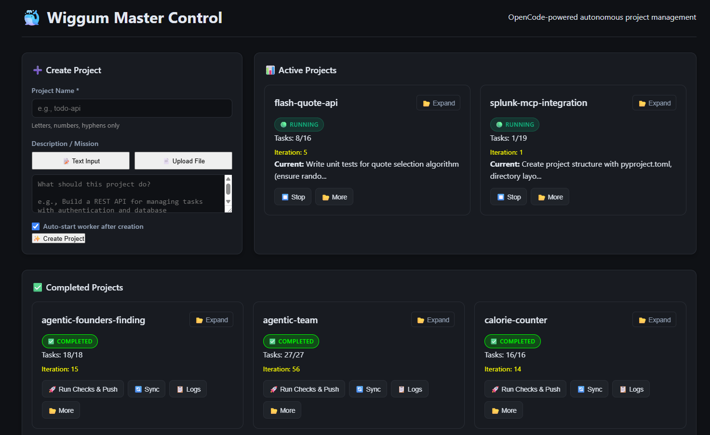
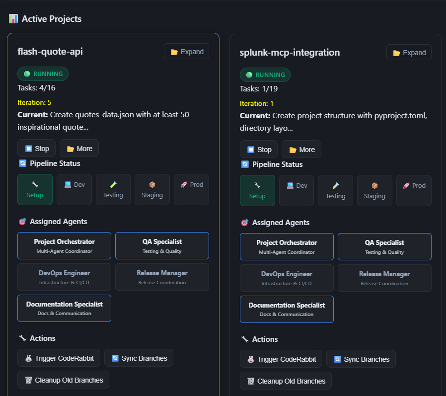
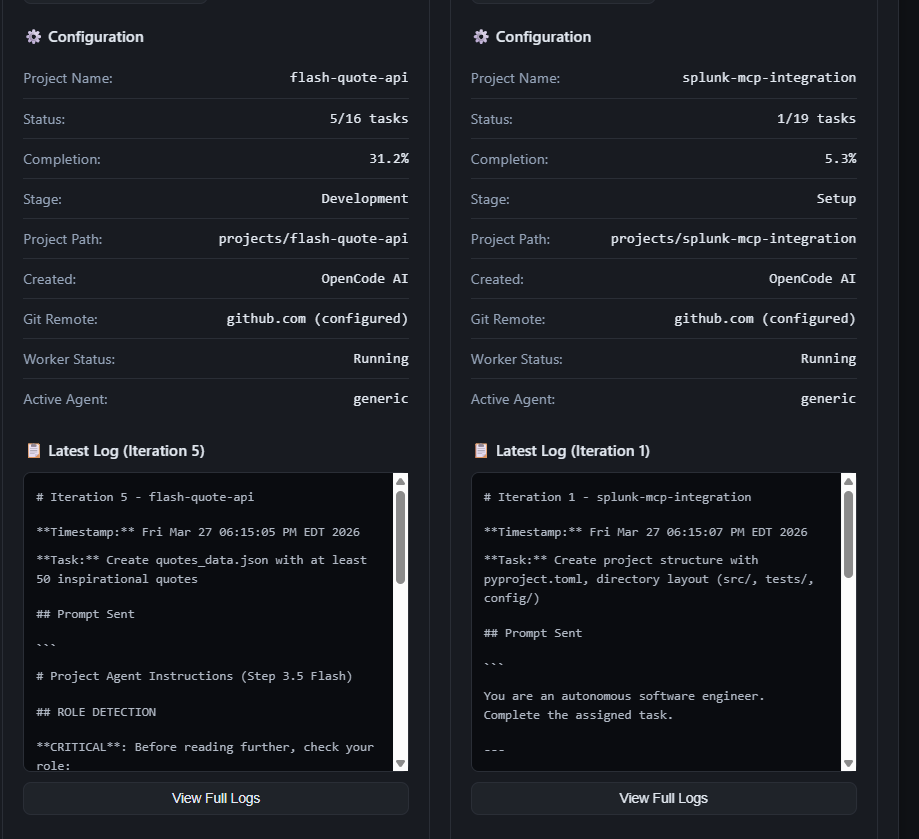
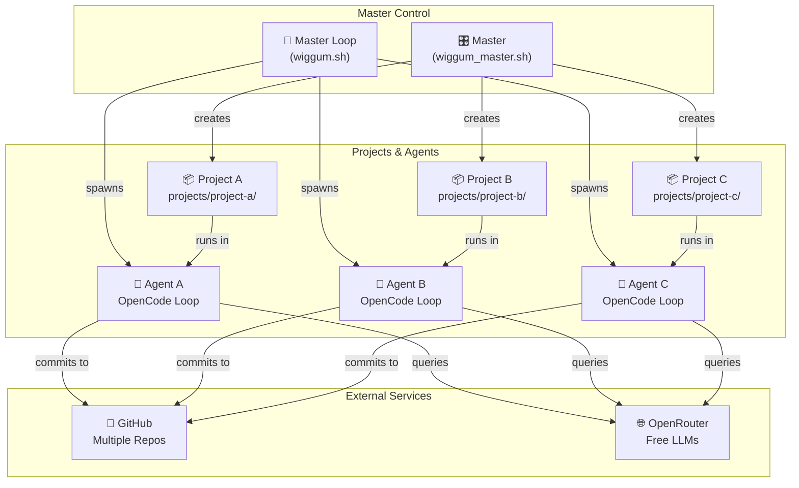
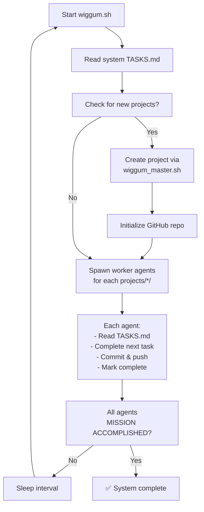
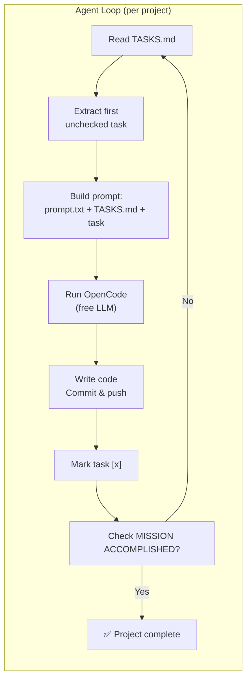

# 🐳 WiggumLoopAgenticSWDeveloper

> **Zero-cost, fully autonomous multi-project AI development.** Orchestrate unlimited OpenCode agents running free LLMs to build, test, and ship software—without writing a single line of code yourself.


<!-- UI Overview -->

<p align="center"><i>WiggumLoop: Full system UI overview (ui3.png)</i></p>

<!-- Optionally keep the old screenshot for reference -->
<!--  -->
---

## 🖼️ User Interface

WiggumLoop comes with a visual dashboard for monitoring and controlling projects. Below are detailed UI screenshots:

<p align="center">
    
    
</p>
<p align="center"><i>Detailed project views: left (ui1.png), right (ui2.png)</i></p>

The main overview (see top) shows the entire orchestration system, while these detailed views focus on individual project management and status.

---

---

## ⚡ TL;DR

What if you could spawn **10+ autonomous AI developers** that each own a project, write code, run tests, and push to GitHub—**for free**?

That's WiggumLoop:

1. **Create a project** → `bash wiggum_master.sh create "my-api" "Build a REST API"`
2. **Write tasks** in `projects/my-api/TASKS.md`
3. **Start the master loop** → `bash wiggum.sh`
4. **Watch it work** → Agents code, commit, push, repeat

No babysitting. No API bills. Just autonomous development.

---

## 🤖 What Is This?

WiggumLoopAgenticSWDeveloper is a **master orchestration system** that:

| ✅ What it Does | 🎯 Why It Matters |
|----------------|-------------------|
| Manages **multiple projects** simultaneously | Each project gets its own GitHub repo and autonomous agent |
| Spawns **independent AI agents** using OpenCode | Projects develop in parallel, 24/7 |
| Orchestrates **master + worker loops** | System-level tasks create/coordinate projects |
| Includes **web dashboard + voice control** (optional) | Monitor and control from a browser |
| Costs **$0/month** (OpenRouter free tier) | Unlimited iterations, no API fatigue |
| Runs **Gemini 2.0 Flash, Qwen 3, Step 3.5 Flash** | Top-tier free models, not toy LLMs |

**Each project is a separate GitHub repository** that develops independently while the master system coordinates everything.

---

## 🏗️ System Architecture



---

## 🔄 Detailed Workflow

### Master Loop Flow



### Agent Iteration Loop



---

## 💰 Why This Is a Game-Changer

| | **WiggumLoop** | **Traditional AI Coding** |
|---|---|---|
| **Cost** | $0 (free LLMs) | $20–600+/month |
| **Setup Time** | 10 minutes | 30 min–2 hours |
| **Projects** | Unlimited (one repo each) | Usually one project per API key |
| **Autonomy** | 24/7 worker loops | Manual prompting per task |
| **Scalability** | Add more projects, no extra cost | Linear cost increase |

**You could run this for a year and still pay nothing.** The only thing it costs is your time to set up and guide it.

---

## 🚀 Quick Start (5 minutes)

### 1️⃣ Install Prerequisites

```bash
# Node.js (for OpenCode)
curl -fsSL https://deb.nodesource.com/setup_18.x | sudo -E bash -
sudo apt-get install -y nodejs

# OpenCode AI (global install)
npm install -g opencode-ai

# GitHub CLI (auth)
gh auth login --web

# Python deps (for optional web dashboard)
pip install -r requirements.txt
```

### 2️⃣ Configure

```bash
# Get free OpenRouter key: https://openrouter.ai
cat > .env << 'EOF'
OPENROUTER_API_KEY=sk-or-v1-YOUR_KEY_HERE
WIGGUM_MODEL=openrouter/google/gemini-2.0-flash-exp:free
EOF

# Initialize system context for OpenCode
opencode /init --yes
```

### 3️⃣ Create Your First Project

```bash
bash wiggum_master.sh create "todo-api" "Build a FastAPI REST API with SQLite and CRUD operations"
```

This creates `projects/todo-api/` with its own GitHub repo.

### 4️⃣ Add Tasks

Edit `projects/todo-api/TASKS.md`:

````markdown
## Todo API

- [ ] Set up FastAPI app with CORS
- [ ] Create SQLite models (Item, User)
- [ ] Implement POST /items endpoint
- [ ] Implement GET /items endpoint
- [ ] Add PATCH /items/{id} endpoint
- [ ] Add DELETE /items/{id} endpoint
- [ ] Write unit tests (pytest)
- [ ] Add request validation (Pydantic)
- [ ] Create requirements.txt
- [ ] Write README with example curl commands
- [x] MISSION ACCOMPLISHED
````

### 5️⃣ Start the Master Loop

```bash
bash wiggum.sh
```

That's it. The master will:
- Read system `TASKS.md`
- Create new projects if needed
- Spawn a worker agent for `todo-api`
- Agent reads `projects/todo-api/TASKS.md`, completes first task, commits, pushes, repeats

---

## 📂 Repository Structure

```
WiggumLoopAgenticSWDeveloper/
├── wiggum.sh                    # 🚀 Master orchestrator (run this)
├── wiggum_master.sh             # Project management CLI
├── server.py                    # Flask web dashboard
├── voice_server.py              # Voice control (optional)
├── prompt.txt                   # Master agent instructions
├── TASKS.md                     # System-level tasks
├── AGENTS.md                    # Auto-generated system context
├── .env                         # Configuration
├── ui.png                       # Dashboard screenshot
│
├── project_template/            # Scaffold for new projects
│   ├── README.md
│   ├── TASKS.md
│   ├── prompt.txt
│   └── src/
│
├── projects/                    # Managed projects (separate GitHub repos)
│   ├── todo-api/
│   │   ├── TASKS.md
│   │   ├── prompt.txt
│   │   ├── logs/
│   │   └── src/
│   └── another-project/
│
└── agents/                      # Specialized agent roles
    ├── generic.md
    ├── devops-engineer.md
    └── ...
```

---

## 🎯 Creating & Managing Projects

### Create a Project

```bash
bash wiggum_master.sh create "project-name" "What this project should do"
```

**What happens:**
- Creates `projects/project-name/`
- Copies `project_template/` files
- Initializes Git repo
- Creates GitHub remote: `github.com/YOU/project-name`
- Pushes initial commit

### Add Tasks

Edit `projects/project-name/TASKS.md`:

```markdown
## Project Name

- [ ] First task (agent does this first)
- [ ] Second task
- [ ] Third task
- [x] MISSION ACCOMPLISHED
```

**Pro tip:** Break tasks into small, verifiable chunks. Agents work better with clear, atomic objectives.

### Control Projects

```bash
bash wiggum_master.sh list          # List all projects
bash wiggum_master.sh status       # Show status (running/stopped)
bash wiggum_master.sh stop "name"  # Stop a worker
bash wiggum_master.sh start "name" # Start a worker
```

---

## 🎭 Agent Roles: Specialize Your Workers

Each project can switch between specialized roles for different phases.

| Role | Best For |
|------|----------|
| `generic` | General full-stack development |
| `devops-engineer` | CI/CD, deployment, infra |
| `qa-specialist` | Testing, quality gates |
| `release-manager` | Versioning, releases |
| `documentation-specialist` | Docs, READMEs, API specs |
| `project-orchestrator` | Planning, delegation |

**Switch roles:**

```bash
cd projects/my-project
echo "devops-engineer" > .agent_role
git add .agent_role && git commit -m "ops: switch to devops-engineer" && git push
```

Next iteration, the agent loads specialized instructions from `agents/devops-engineer.md`.

---

## 🔁 Resilience: Stuck Detection & Recovery

The worker **automatically detects** when a task is stuck (no progress for 5 iterations) and applies recovery strategies:

1. **Decompose** – breaks the task into subtasks
2. **Skeleton files** – creates minimal structure to unblock
3. **Skip & retry later** – moves on, will retry later

You don't have to micromanage. The system self-corrects.

---

## 🚨 CI/CD Error Handling

When builds/tests fail, the worker extracts the error and:

- **Code errors?** → Agent fixes the code
- **Dependency/version errors?** → Agent updates version constraints
- **Environment setup errors?** → Mark as `[CI-SKIP]`, document as prerequisite

It **never** installs system tools or downloads large files. It only modifies code, configs, and version numbers.

---

## 🛠️ Advanced Features

### Web Dashboard (Optional)

```bash
pip install -r requirements.txt
python3 server.py
# Visit: http://localhost:5000
```

Features:
- Real-time project status
- Create/stop/start projects from UI
- View logs inline
- Trigger CodeRabbit reviews

### Background Operation

```bash
# Run master loop in background
nohup bash wiggum.sh > logs/master.log 2>&1 &
```

### Logs

Each project logs iterations to `projects/<name>/logs/`. Inspect with:

```bash
tail -f projects/todo-api/logs/iteration-*.log
```

---

## ⚙️ Configuration

### `.env` Options

```bash
OPENROUTER_API_KEY=sk-or-v1-...   # Required (free from openrouter.ai)
WIGGUM_MODEL=openrouter/google/gemini-2.0-flash-exp:free
GITHUB_USER=your-username
MASTER_SLEEP_INTERVAL=300         # Seconds between master loops
```

### Recommended Free Models

- `openrouter/google/gemini-2.0-flash-exp:free` ⭐ Best overall
- `openrouter/qwen/qwen-3-80b` – Strong reasoning
- `openrouter/stepfun/step-3.5-flash:free` – Fast & reliable

---

## 🐛 Troubleshooting

| Problem | Fix |
|---------|-----|
| `opencode: command not found` | `npm install -g opencode-ai` |
| GitHub auth fails | `gh auth logout && gh auth login --web` |
| API key invalid | Get new key at openrouter.ai, update `.env` |
| Agent loops hanging | Check `logs/master.log`, kill process, verify `wiggum.sh` is running |
| Project repo not created | `gh auth status` – ensure you're logged in |

---

## 📚 Resources

- [OpenCode GitHub](https://github.com/ripienaar/opencode)
- [OpenRouter Docs](https://openrouter.ai/docs)
- [GitHub CLI Manual](https://cli.github.com/manual)
- [Free Model List](https://openrouter.ai/models)

---

## 📋 Core System Files

### `wiggum.sh` — The Engine

The master orchestrator. It:
- Reads `TASKS.md` for system tasks
- Creates projects via `wiggum_master.sh`
- Spawns worker agents for each project
- Sleeps and repeats

**This is the only script you need to run** for full autonomy.

### `wiggum_master.sh` — Project Manager

CLI for creating, listing, starting, stopping projects. Handles GitHub repo creation and project scaffolding.

### `prompt.txt` — Agent Instructions

The system prompt sent to OpenCode on every iteration. Defines agent behavior, constraints, and workflow.

### `TASKS.md` — Task Tracking

Markdown checklist. The master loop reads this to know what to do. Each project has its own `TASKS.md`. The loop stops when it finds `[x] MISSION ACCOMPLISHED`.

### `project_template/` — Blueprint

When you create a project, it's copied from here. Customize this template to change default project structure.

---

## 🎬 Example: From Zero to Autonomous Project

```bash
# 1. Create project
bash wiggum_master.sh create "weather-bot" "Telegram bot that posts daily forecast"

# 2. Add tasks (edit projects/weather-bot/TASKS.md)
#    - [ ] Set up python-telegram-bot
#    - [ ] Integrate OpenWeatherMap API
#    - [ ] Schedule daily message at 8 AM
#    - [ ] Add error handling + logging
#    - [x] MISSION ACCOMPLISHED

# 3. Start master loop
bash wiggum.sh

# 4. Done. Watch GitHub repo get commits.
```

The agent will:
- Build a Telegram bot skeleton
- Add weather API integration
- Implement scheduling
- Add error handling
- Mark each task complete as it goes
- Push to GitHub

---

## 🦄 Why This Is One of My Favorite Projects

- **It just works.** Set it and forget it. Agents run for days without intervention.
- **Zero cost = zero guilt.** Run as many experiments as you want. Fail fast, learn faster.
- **You stay in control.** Tasks are plain Markdown. No proprietary UI lock-in.
- **It scales linearly.** Want 5 more projects? Just create them. No extra API cost.
- **It's transparent.** Every prompt is saved as `prompt-*.md`. Every commit is on GitHub.

This isn't just a coding assistant—it's an **autonomous development team** that never sleeps, never asks for a raise, and never bills you by the hour.

---

## 📖 License

MIT. Do whatever you want with it.

---

**Built with OpenCode. Powered by free LLMs. Orchestrated by Wiggum.**